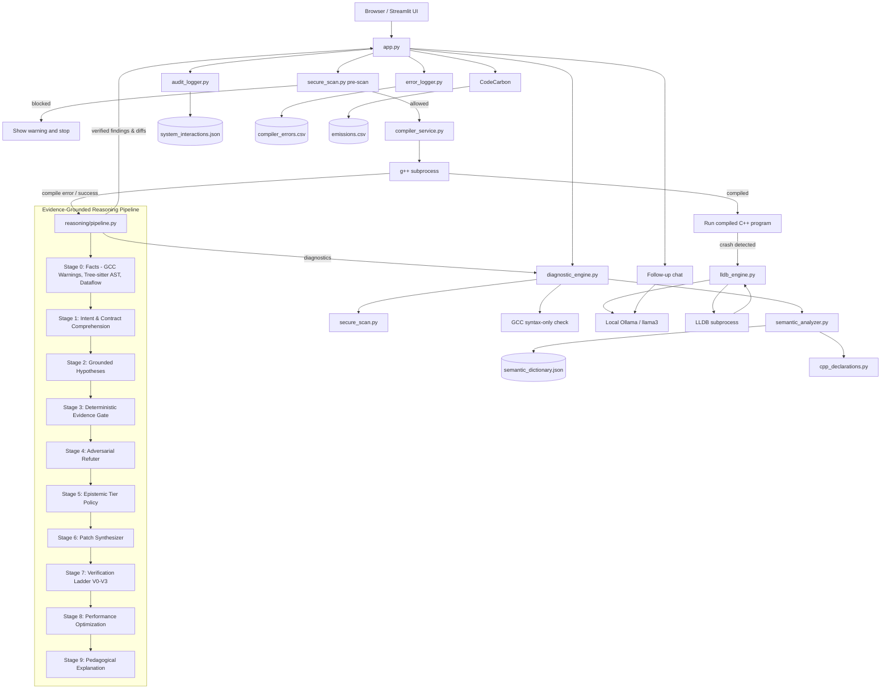

# Chatbot-Driven C++ Compiler Debugger: Architecture and Project Map

This document describes the current implementation in this workspace. The Python source is authoritative where older project notes differ from runtime behavior.

## 1. Project Summary

The project is a Streamlit application for compiling and debugging C++ code with optional local AI assistance. `app.py` is the UI and workflow orchestrator. It invokes local Python modules, external command-line tools, and a local Ollama service. There is no separate API server, database, or frontend build system.

The project is currently running at `http://localhost:8501` when started with the workspace virtual environment.

## 2. Workspace and Project Folder Structure

The workspace root contains the application folder plus separate samples, logs, and development artifacts:

```text
C:\TOACD_PROJECT\
├── .git\                              Workspace Git metadata
├── .venv\                             Python virtual environment
├── .vscode\                           Empty editor-settings folder
├── Chatbot-Driven-Compiler-Debugger\  Main application project
├── check.cpp                           Workspace-level C++ sample
├── check.exe                           Workspace-level compiled artifact
├── compile_check.py                    Workspace-level compile helper
├── compiler_errors.csv                 Workspace-level error log
├── emissions.csv                       Workspace-level CodeCarbon log
├── PROJECT_DEEP_CONTEXT.md             Source-based code audit
└── system_interactions.json            Workspace-level interaction history
```

The application folder contains:

```text
Chatbot-Driven-Compiler-Debugger/
├── .git\                              Nested Git metadata
├── .gitignore
├── .DS_Store                           macOS metadata
├── app.py                              Streamlit UI and workflow orchestration
├── audit_logger.py                     JSON interaction logging
├── cpp_declarations.py                  Lightweight C++ tokenizer/declaration extractor
├── compiler_errors.csv                 Project-folder compiler-error data
├── compiler_service.py                 C++ compilation and execution
├── diagnostic_engine.py                Live and post-compile diagnostics
├── emissions.csv                       Project-folder CodeCarbon data
├── error_classifier.py                 Compiler-error categorization and prompts
├── error_logger.py                     Compiler-error parsing and CSV logging
├── final_tests.cpp                     Four manual demonstration scenarios
├── fix_engine.py                       AI fix extraction and security validation
├── github_link.txt                     Repository URL
├── github_risk_data.csv                Security-keyword occurrence data
├── lldb_engine.py                      Ollama-directed LLDB debugging loop
├── PROJECT_ANALYSIS.md                 Project analysis notes
├── PROJECT_ARCHITECTURE.md             This architecture reference
├── README.md                           Short project introduction
├── requirements.txt                    Python dependencies
├── secure_scan.py                      Regex-based C++ denylist
├── semantic_analyzer.py                Name/type consistency analysis and safe fixes
├── semantic_dictionary.json             Semantic name/category knowledge base
├── system_interactions.json            Project-folder interaction history
├── temp_program.exe                    Existing compiled artifact
├── temp_source.cpp                     Existing submitted-source artifact
├── test1.cpp                            Example C++ sorting/compiler case
├── verify_cpp.py                       Standalone compiler-service helper
├── reasoning\                         Evidence-grounded C++ reasoning pipeline
│   ├── __init__.py                     Public entry point: run_reasoning()
│   ├── config.py                       Profiles, budgets, timeouts, feature flags
│   ├── models.py                       Dataclasses: Fact, Candidate, Finding, Tier, etc.
│   ├── compiler_facts.py               Rich GCC warnings compile (-Wall -Wextra JSON)
│   ├── syntax_tree.py                  Tree-sitter AST scopes, decls, read/writes
│   ├── dataflow.py                     Intra-procedural dataflow & unassigned analysis
│   ├── facts.py                        Stage 0 fact collector
│   ├── schemas.py                      Strict JSON schemas for Ollama stages
│   ├── prompts.py                      Prompt templates for LLM stages
│   ├── llm_client.py                   Consolidated Ollama client with retry & timeout
│   ├── evidence_gate.py                Deterministic citation & hallucination gate
│   ├── refuter.py                      Adversarial counterexample generator
│   ├── tier_policy.py                  Epistemic certainty ceiling & hedging
│   ├── patching.py                     Minimal surgical diff application
│   ├── verify.py                       Verification ladder (V0-V3)
│   ├── optimize.py                     Stage 8 performance/optimization analysis
│   ├── adapters.py                     Adapters to live diagnostics, chat, & patches
│   └── pipeline.py                     Stage 0-9 orchestrator with budget management
├── tests\
│   ├── test_diagnostics.py             Unit tests for diagnostics
│   ├── test_cpp_declarations.py         Tokenizer and declaration tests
│   ├── test_semantic_analyzer.py        Dictionary, warning, and fix tests
│   ├── reasoning\
│   │   └── test_reasoning.py           Reasoning pipeline deterministic test suite
│   └── __pycache__\                    Generated test bytecode
└── __pycache__\                        Generated Python bytecode
```

The workspace root and application folder each have their own `.git` metadata directories. `.venv`, `.git`, `.DS_Store`, and `__pycache__` are environment, repository, metadata, or generated files rather than application modules. Runtime artifacts can be created or replaced during use; the exact executable filename can vary by compiler and operating system.

## 3. Architecture Diagram



## 4. Module Responsibilities and Connections

- **`app.py`** builds the two-column Streamlit interface, maintains session state, and orchestrates all workflows. It routes compilation results through the evidence-grounded reasoning pipeline (`reasoning/`) when enabled, falling back gracefully to legacy paths if unavailable.
- **`reasoning/`** implements the evidence-grounded *Fact → Hypothesis → Verification* pipeline. It collects deterministic compiler warnings (with GCC notes and JSON), builds Tree-sitter ASTs and intra-procedural dataflow models, gates candidate claims against cited facts, refutes false positives, enforces epistemic certainty ceilings, synthesizes surgical line patches, and tests fixes through a multi-stage verification ladder.
- **`diagnostic_engine.py`** powers the live diagnostics panel. It runs AST-based scope tracking for variable shadowing (avoiding false positives on sibling loops), duplicate declaration detection, local security scans, and debounced GCC checks.
- **`cpp_declarations.py`** tokenizes common C++ syntax while skipping comments, literals, and preprocessor directive bodies. It extracts conservative declarations with source spans and broad scope labels; uncertain forms are skipped.
- **`semantic_analyzer.py`** normalizes identifier naming styles, resolves names through the dictionary, compares semantic categories with C++ type families, reports confidence-ranked findings, and plans minimal high-confidence local edits. It never executes submitted code.
- **`semantic_dictionary.json`** provides the versioned vocabulary, compound-name rules, ambiguous terms, abbreviations, and boolean/count naming rules. It contains more than 500 distinct name tokens and has a small built-in fallback.
- **`secure_scan.py`** defines regex patterns for risky C++ constructs. `run_security_guardrail()` returns the first denylist match for the pre-execution gate and generated-fix check. `scan_all_security_issues()` returns all matching patterns for diagnostics.
- **`compiler_service.py`** writes submitted source to `temp_source.cpp`, invokes `g++ -g`, and runs the executable. It returns a status, output, and error text to `app.py`.
- **`error_classifier.py`** maps compiler output to broad categories such as syntax, linker, type mismatch, runtime timeout, security warning, or general error. It also builds the constrained prompt used for AI compiler explanations and suggested fixes.
- **`fix_engine.py`** extracts a C++ Markdown code block from the model response and scans that code with `run_security_guardrail()` from `secure_scan.py`. It does not compile or execute the proposed fix.
- **`lldb_engine.py`** implements the runtime-debugging loop. It requests a JSON decision from Ollama, runs an LLDB command in batch mode when selected, and feeds the output back to the model for up to two turns.
- **`audit_logger.py`** appends interaction records to `system_interactions.json`, including timestamp, category, code, prompt, response, and suggested fix.
- **`error_logger.py`** parses compiler output and appends a row to `compiler_errors.csv`, including the error text and source snippet when it can identify a line.
- **`tests/test_diagnostics.py`** tests local checks, compiler diagnostic parsing, debounce behavior, diagnostic merging, and rendering.
- **`tests/test_cpp_declarations.py`** tests tokenization, source spans, standard-library types, and scope labels.
- **`tests/test_semantic_analyzer.py`** tests dictionary integrity, ambiguity handling, false-positive controls, and safe-fix restrictions.
- **`tests/reasoning/test_reasoning.py`** tests compiler fact extraction, dataflow probes, evidence gate validation, refuter logic, tier policy assignment, patch application, and the verification ladder.

## 5. End-to-End Workflows

### Live diagnostics while editing

1. Streamlit calls the diagnostics fragment periodically.
2. When the editor contents change, `app.py` asks `diagnostic_engine.py` to run cached local checks.
3. After the editor has been quiet for about 2.5 seconds, the engine can invoke `g++ -fsyntax-only -std=c++17` against a unique temporary file.
4. Local and compiler results are merged, sorted, and shown in the diagnostics panel.

The local checks include denylist findings, likely unbalanced brackets or unterminated literals, generic identifier suggestions, duplicate/shadowed variable warnings, and semantic name/type consistency warnings. Semantic analysis uses a lightweight tokenizer rather than a C++ AST; it skips uncertain forms and treats names as evidence, not proof. Live semantic findings default to LOW confidence.

### Compile and analyze

1. The user clicks **Compile & Analyze**.
2. `app.py` starts an emissions tracker and calls the pre-scan in `secure_scan.py`.
3. If blocked, the app reports the warning, records metrics, and stops before compilation.
4. If allowed, semantic analysis runs once for the click; analyzer failures are non-blocking.
5. Any high-confidence local primitive correction is denylist-scanned and syntax-checked against the original with GCC before display.
6. `compiler_service.py` writes the C++ source, compiles it, and runs the result.
7. The app handles the result as a success, compilation/process failure, or detected runtime crash, then displays semantic findings with the result.

Compilation uses `g++ -g` with a 10-second timeout; execution has a 5-second timeout.

### Successful execution

The app displays the program output and requests an AI logic review from Ollama. It adds the answer to the chat history, logs the interaction, and records the emissions metrics.

### Compilation failure

The app logs the compiler output, classifies it, creates an AI diagnostic prompt, and asks Ollama for an explanation and corrected C++ code. `fix_engine.py` extracts a matching code block and checks it against the security denylist. If it passes, the app displays it as a verified-looking suggestion; it is not recompiled or executed.

### Runtime failure

When the compiler service reports a crash according to its return-code test, `app.py` calls `agentic_debug_loop()` in `lldb_engine.py`. The model may request an LLDB command; LLDB runs it in batch mode and returns output for another model turn. The loop allows at most two turns before returning a diagnosis or a halt message.

### Follow-up chat

The follow-up prompt includes the current C++ editor contents and recent chat messages. `app.py` sends it to Ollama, displays the response, and records the interaction.

## 6. External Dependencies and Runtime Requirements

Python packages from `requirements.txt`:

- `streamlit` for the web UI and reruns/session state.
- `streamlit-ace` for the C++ editor.
- `requests` for Ollama HTTP requests.
- `codecarbon` for energy and emissions tracking.

External programs/services:

- **`g++`** must be available on `PATH` for syntax checks, compilation, and execution.
- **Ollama** is expected at `http://localhost:11434`; the configured model is `llama3`. The app attempts to start the Ollama server if it cannot connect, but the model must already be installed. AI responses can be unavailable while the rest of the UI is running.
- **`lldb`** must be available on `PATH` for the LLDB branch.

The app is local-first: AI requests go to the local Ollama HTTP API; there is no cloud AI API configured in the source.

Semantic analysis is enabled by default and can be disabled from the Streamlit sidebar. Set `SEMANTIC_ANALYSIS_ENABLED=false` to default it off. Compile-result confidence defaults to MEDIUM; the live panel uses LOW. The optional semantic-context checkbox adds up to five deterministic findings to the existing successful-run AI review prompt, without a separate model call.

## 7. Logs, Data, and Development Files

- `system_interactions.json` stores chat and analysis interaction records. There is one copy in the workspace root and one in the application folder.
- `compiler_errors.csv` stores parsed compiler failures. There are copies at both the workspace root and application folder.
- `emissions.csv` is written by CodeCarbon. There are copies at both locations.
- `github_risk_data.csv` contains keyword occurrence counts; it is static data, not part of the active request path.
- `final_tests.cpp` contains four manual scenarios: denylist blocking, compile error, runtime failure, and successful compilation with logic review.
- `test1.cpp` is a sorting/comparator example intended to exercise compiler diagnostics.
- `verify_cpp.py` and the workspace-level `compile_check.py` are standalone helpers, not imported by the Streamlit app.
- `check.cpp` and `check.exe` at the workspace root are standalone sample/build artifacts.
- `temp_source.cpp` and the compiled program are compiler-service runtime artifacts. The LLDB self-test code in `lldb_engine.py` can also create `debug_target.cpp` and `debug_target.bin` when run directly; those files are not currently in the listed project inventory.
- `PROJECT_ANALYSIS.md`, `README.md`, and the workspace-level `PROJECT_DEEP_CONTEXT.md` are documentation. The deep-context file is a source audit; this file is the consolidated architecture and folder map.

## 8. Implementation Caveats

- The subprocess timeouts and regex denylist do **not** create an operating-system sandbox. The scanner is not comprehensive, and compiling/running user C++ is not isolated in a container or restricted process environment.
- AI-generated fixes are only checked for a matching code fence and denylist patterns. They are not automatically compiled, executed, or semantically verified.
- The loggers use paths relative to the process working directory, whereas compiler temporary source/executable paths are based on the module directory. Therefore, logs may be written to the workspace root or project folder depending on how Streamlit is launched.
- `compiler_service.py` compiles a file named `temp_source.cpp`, while `error_logger.py`'s parsing regex looks for `temp_code.cpp`. As a result, line/error extraction can fall back to `Unknown` for current compiler output.
- The LLDB call in `app.py` passes `./temp_program`, relative to the process working directory, rather than deriving the compiler service's absolute executable path. This can point at the wrong location when launched from the workspace root; executable suffixes also vary by platform.
- Runtime crash detection in `compiler_service.py` checks for a negative process return code. Signal/exception return-code behavior differs by operating system, so the runtime-debugging branch is platform-sensitive.
- The LLDB agent prompt describes an Apple Silicon environment even though the current workspace is Windows. LLDB availability and crash behavior should be verified on the target machine.
- The runtime branch currently calls the LLDB agent; the generated suggested fix is not passed through the same `fix_engine.py` validation path used for compile-error fixes.
- The diagnostics tests focus on `diagnostic_engine.py`; they do not verify the whole UI-to-compiler-to-Ollama/LLDB flow.
- Semantic findings are heuristic and advisory, not compiler errors. Automatic corrections are limited to high-confidence local primitive/literal cases; globals, parameters, members, loops, multi-declarators, pointers, references, collections, `auto`, calls, expressions, and potentially incompatible later uses are suggestion-only. Corrected code is display-only and is never applied to the editor or executed.
